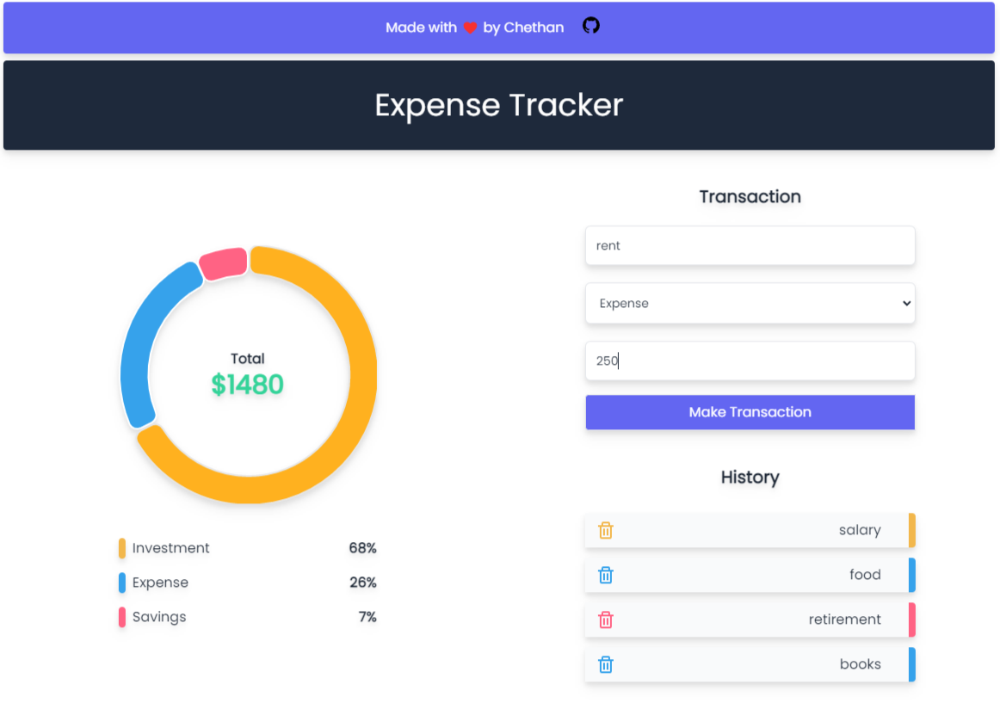
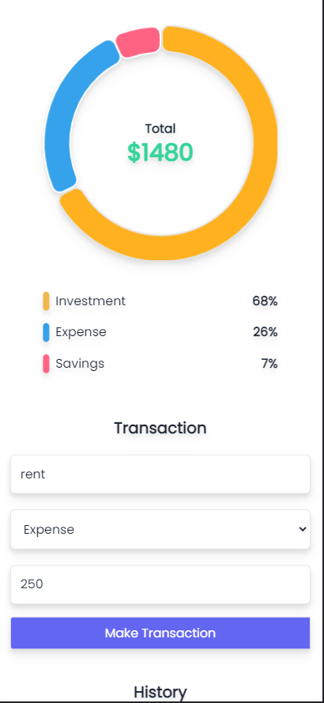

# Project Title

Complete MERN Stack Expense Tracker Application with RTK Query. Fully Responsive.

This Web Application demonstrates my capability to perform CRUB operations in MERN stack and the use of aggregation pipeline in MonogDB.

If you get any Error which the application loads for the first time please wait for 5seconds and refresh the page. Application should be good to go.

## Tech Stack

**Client:** React, Redux-toolkit, Redux RTK Query, TailwindCSS

**Server:** Node, Express, MongoDB

**Others:** lodash, heroku, git
## Demo

https://expensetracker-client.vercel.app

## Screenshots

HomePage

Fully Responsive

## Features

- Users can input their expenses via a Form. Currently there are 3 types of expenses : Savings, Investments, expenses
- Users can choose any type of Expense and submit the Form
- Application will retrieve data from server everytime data is updated and show users previous expense in a History section
- Application also shows users Expense in the form a doughnut Chart and also shows all the 3 types expense in percentage format
- Complete Total of all expense is showed inside doughnut chart.

